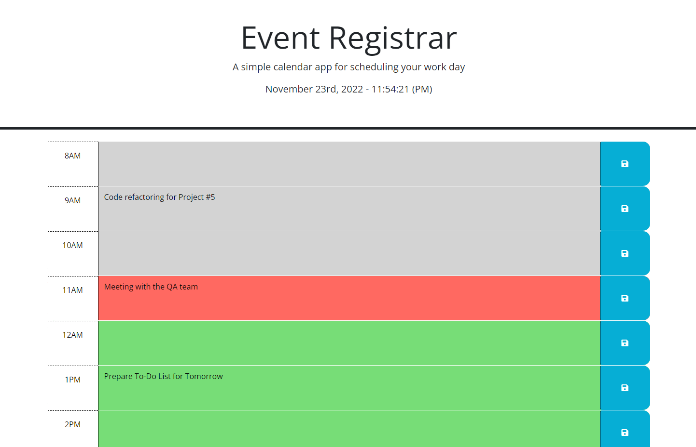
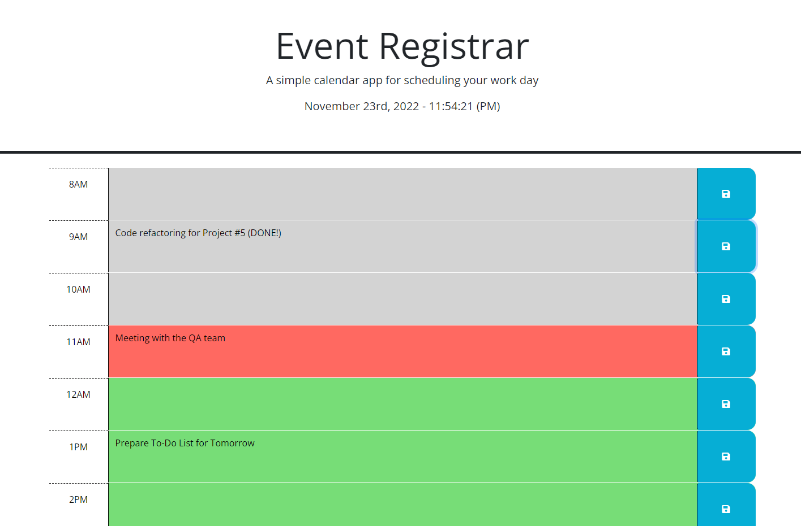

# Event Registrar

## Description

This project was created to practice and improve knowledge of JQuery, Bootstrap and 3rd party APIs. Also, the files with the code of this project are great as a tutorial for beginner developers.

Repository: [repo](https://github.com/RufatEskendarov/Event_Registrar)

WebApp: [webapp](https://rufateskendarov.github.io/Event_Registrar/)

## User Story:

AS AN employee with a busy schedule
I WANT to add important events to a daily planner
SO THAT I can manage my time effectively

## Acceptance Criteria:

- GIVEN I am using a daily planner to create a schedule;
- WHEN I open the planner
  THEN the current day is displayed at the top of the calendar;
- WHEN I scroll down
  THEN I am presented with time blocks for standard business hours;
- WHEN I view the time blocks for that day
  THEN each time block is color-coded to indicate whether it is in the past, present, or future;
- WHEN I click into a time block
  THEN I can enter an event;
- WHEN I click the save button for that time block
  THEN the text for that event is saved in local storage;
- WHEN I refresh the page
  THEN the saved events persist.

## Installation

This application does not require installation, just follow the link:[webapp](https://rufateskendarov.github.io/Event_Registrar/)

## Usage

1. By clicking on the link to the webapp, you will be taken to the home page with the app name and current date and time under it.You will also see the hours of the working day from 08 am to 05 pm, sections and buttons to save the corresponding hours.(Screen-1);
2. The hour sections will be colored. The current hour will be red, the past hour sections will be grey, and the future hour sections will be green. You can enter upcoming or completed tasks, as well as notes in the section and by pressing the blue button with the image of a diskette. As a result of this action, the text will be saved to local storage.(Screen-1);
3. You can also delete or add comments saved in the local storage. Simply Delete the text and click on the save button or complete it and repeat the action. (Sсreen-2);

## Credits

In this project, I used the methods and templates acquired in the JavaScript course from Jonas Schmidtmann [JonasSchmidtman](https://www.udemy.com/course/the-complete-javascript-course/).

## License

In accordance with https://choosealicense.com/licenses/gpl-3.0/

## Features

- HTML5
- CSS3
- JavaScript
- DOM manipulations
- JQuery
- Bootstrap
- 3rd party APIs

## How to Contribute

Please review my page if you have ideas or advises please contact me (rufat.eskendarov@gmail.com)

## Tests

Manual testing was carried out on the application, no errors or bugs were found. If you encounter problems while using the app, please contact me (rufat.eskendarov@gmail.com).
